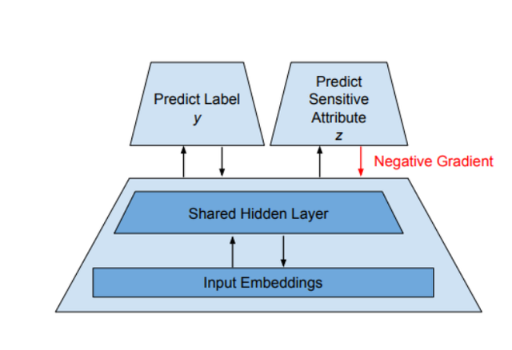
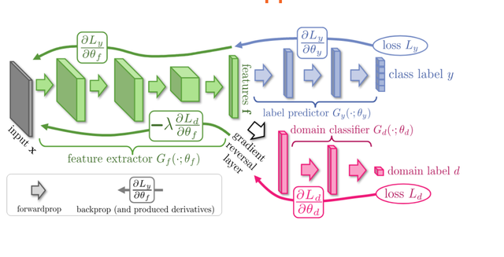

- [Bias-Free-Hatespeech-Detection](#bias-free-hatespeech-detection)
  - [Idea](#idea)
  - [Mathematical Representation](#mathematical-representation)
  - [Approach](#approach)
    - [Adversarial Training](#adversarial-training)
    - [Preprocessing](#preprocessing)
    - [Categorization of Bias](#categorization-of-bias)
    - [Feature Space](#feature-space)
    - [Network Architecture Approach 1](#network-architecture-approach-1)
    - [Network Architecture Approach 2](#network-architecture-approach-2)

 

# Bias-Free-Hatespeech-Detection
The aim of this project is to propose novel idea for bias-free hatespeech detection. Among multiple methods like: Transfer Learning, Adversarial Approaches for Gender-Free Hatespeech Detection, Bias-Free Deep Learning architecture for classification etc., we have implemented an 
Adversary based approach for achieveing the task.

## Idea
An adversarial training procedure to remove information about the sensitive attribute from the representation learnt by the neural network.

## Mathematical Representation
A supervised deep learning task in which it is required to predict an output variable $Y$ given an input variable $X$, while remaining unbiased with respect to some variable $Z$. Here $X$ is a given statement/corpus, $Y$ represents whether statement is Hate or not and $Z$ represents the set of protective features from which we want $Y$ to be unbiased.

## Approach
### Adversarial Training
Combining competing tasks has been found to be a useful tool in deep learning. This technique has been applied for making models fair by trying to prevent biased representations.

We could use an adversarial training procedure to remove information about the sensitive attribute from the representation learned by a neural network. In particular, we might study how the choice of data for the adversarial training effects the resulting fairness properties.

### Preprocessing
Labelling of hate tweets :
Analysing the content of the tweet - Depending on presence of certain words we are labelling a tweet as hate/non-hate.

### Categorization of Bias
Dataset used for this project contains $~24$k tweets with four labels - Sexist, Racist, Neither and Both. But since we are dealing with a binary classification problem, all racist tweets are labelled as 1, and the rest, labelled as 0. 

### Feature Space
$F_y :{F_{y1}, F_{y2},......,F_{yk}}$ and $F_z : {F_{z1}, F_{z2},......,F_{zk}}$

There are two possibilities:

 - $F_y ∩ F_z = \phi$  
    This implies that the predictor and adversary don’t share any common feature and hence removing adversarial features won’t affect predictor’s ability.

- $F_y ∩ F_z ≠ \phi$  
    This implies that there is an intersecting set of features between the discriminator and the adversary. Hence, removing the adversarial features might affect the performance of the discriminator network.

 

### Network Architecture Approach 1

 

### Network Architecture Approach 2

